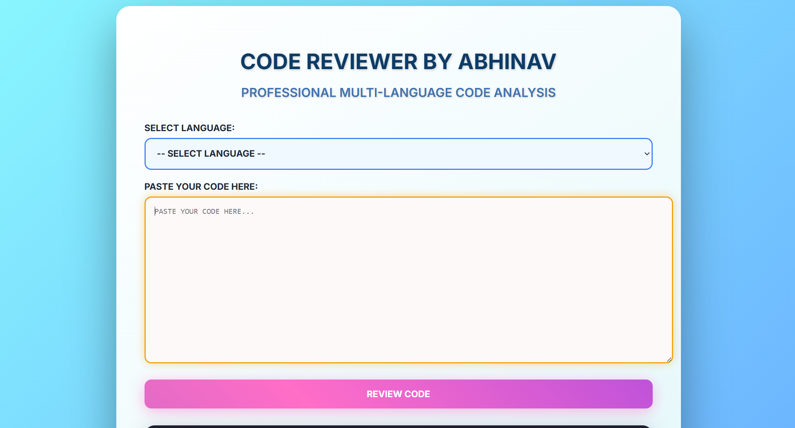
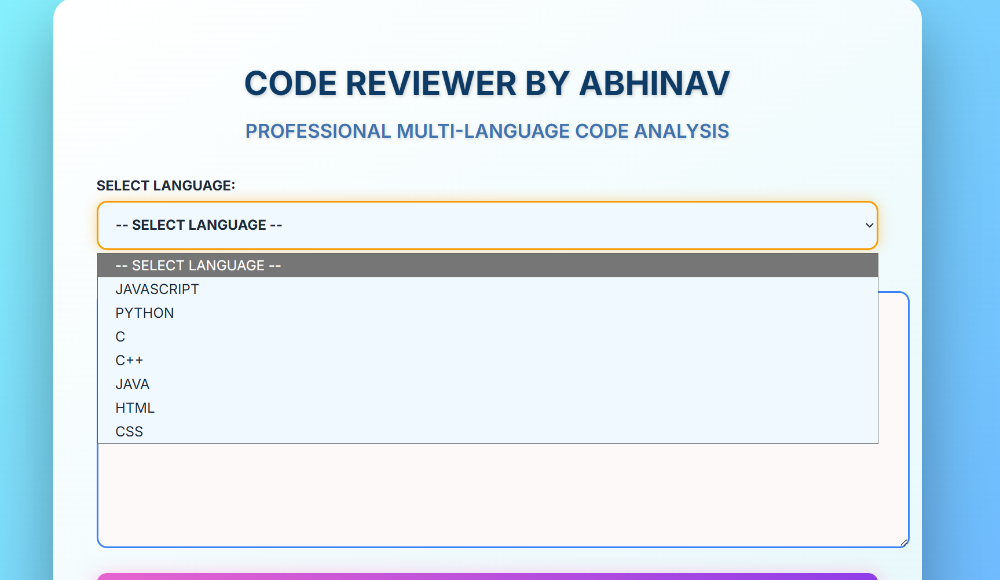
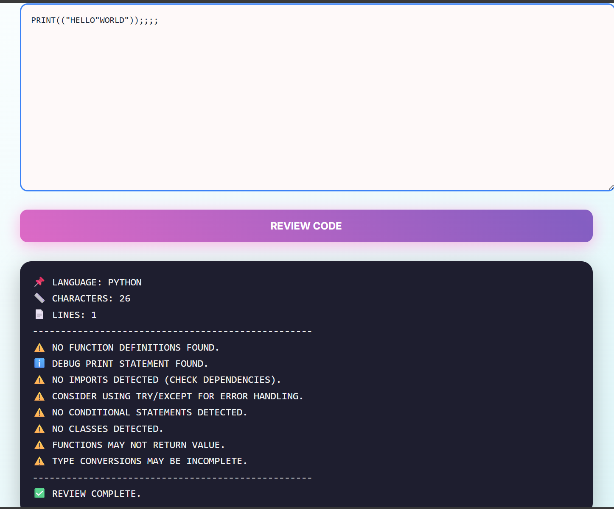

# AI Code Reviewer

This is a professional AI-based code reviewer created by **Abhinav Devadiga**.

## Features
- Reviews Python, JavaScript, HTML code.
- Colorful and shiny UI with hover and glow effects.
- Easy to use.

## Screenshots




## How to Run
1. Clone the repository:
   ```bash
   git clone https://github.com/ABHINAVNDEVADIGA/ai-code-reviewer.git
