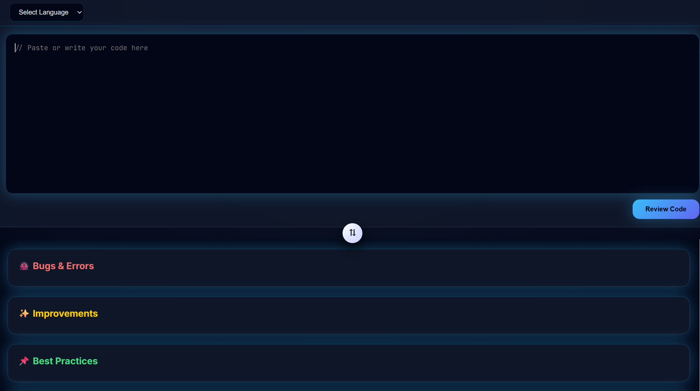

# AI Code Reviewer

This is a professional AI-based code reviewer created by **Abhinav Devadiga**.

## 🎥 Demo Output

▶️ [Click here to watch the demo video](media/OUTPUT.mp4)




## Features
- Reviews Python, JavaScript, HTML code.
- Colorful and shiny UI with hover and glow effects.
- Easy to use.

## How to Run
1. Clone the repository:
   ```bash
   git clone https://github.com/ABHINAVNDEVADIGA/ai-code-reviewer.git
add your api key in .env file
   GROQ_API_KEY=YOUR_API_KEY
   npm install express cors dotenv groq-sdk
   npm start
## License
This project is licensed under the MIT License.
